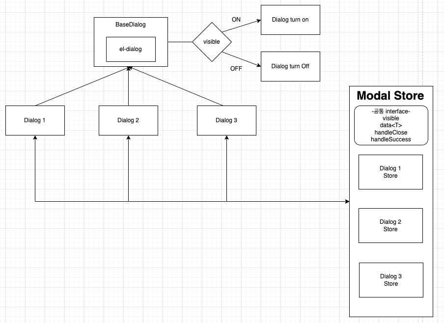

# Dialog에 대한 연구
## 과거 사용 사례
기존 Vue2에서 프로젝트를 진행할 때 Dialog를 띄울 때 Modal 컴포넌트들을 이벤트 버스에 등록하여,  
플러그인으로 Vue에 설치하여 꺼내 쓰는 방식으로 진행을 했었다.

근데,  
Vue3에서는 이벤트 버스 방식에 대해 더 이상 사용을 하지 말아달라고 권장하고, 그 대신에 스토어를 사용해달라고 권장한다.

기존 Vue2로 진행할 때에는, 다음과 같은 방식으로 사용을 했는데 굉장히 편했었다.
```typescript
this.$dialog.showSenderSelectDialog({
      senderKey: '',
      selectOnHide: false,
      caseKey: this.caseKey,
      onSelect: ($event: any, row: CaseInfoSenderListInfo) => {
        // ...
      }
    });
```
앞에 this가 붙어 있었던 이유는, 예전 프로젝트 할 땐 `class component`로 진행을 했었기 때문..  
위와 같은 방식을 고수했던 건 다음의 이유들이었다.
- dialog를 사용하는 컴포넌트 또는 페이지에서 템플릿에 인자를 넣는 행동이 귀찮고 알아보기 힘들었다. 
- 콜백(액션) 함수 구성하기가 편했고, 인자로 넘기기가 편했다.
- 다중 다이얼로그를 띄울 수 있다.

다중 다이얼로그는 이제 플러그인 방식으로 진행하지 않을 것이기에 Element-plus에서 제공하는, `append-to-body` 프로퍼티를 `el-dialog` 컴포넌트에 기본적으로 붙여놓을 것이다.    
확실히 `vue component`에 인자를 직접 넘기능 방식보단 이렇게 코드로 관리되는 게 보기 편하다.  
또한 event를 발행/구독(`emit`)처리를 안 해도 되기에 코드 가독성도 더 수월해져 좋았다.

이제는 Vue3로 넘어왔으니, Vue3에 맞게 사용을 맞춰나가야 한다.

## Vue3(Nuxt3)에서 Dialog 사용 연구
앞서 얘기했지만, Vue3에서 EventBus사용은 권장하지 않는다. 심지어 외부 라이브러리를 설치하라고까지 얘기한다.
> https://v3-migration.vuejs.org/breaking-changes/events-api.html

그래서, 
Nuxt3에서 제공하는 `useState` composable을 사용할까, 아니면 스토어 라이브러리 pinia를 사용할까 고민하다가,  
결국 pinia를 채용했다.

프로젝트 규모가 작을 때 `useState`를 사용하고 규모가 커지면 pinia를 사용하라고 하지만 그런 거 따질 시간도 아깝고,  
개발자 사용 경험상 편한 pinia를 쓰는 게 좋다고 판단했다.

전체적인 흐름은 다음과 같다.


Element Plus의 `el-dialog`를 감싼 `BaseDialog` 컴포넌트에서의 값들은 `props`로 관리되게 하고 따로 스토어로 관리하지 않는다.  
그러나, `BaseDialog` 컴포넌트를 사용하는 `Dialog` 컴포넌트들은 내부 값들을 따로 `store`에서 관리된다.  
즉, dialog의 visible 처리, data, 각종 콜백 함수들은 전부 따로 스토어를 구성하여 처리하게 하는 것이다.

폴더 구조로 보면 다음과 같이 말이다. 연관된 폴더, 파일만 표시되게 그렸다.
```text
+-- components
|   +-- base
|         BaseDialog.vue
|   +-- common
|         ConfirmDialog.vue
|   +-- domain
|         ProductDetailDialog.vue
+-- store
|   +-- dialog
|         confirmDialog.ts
|         index.ts
|         productDialog.ts
```

위와 같이 구성하면 dialog를 사용할 때 템플릿만 선언하면 되며, 템플릿에 이벤트 및 props를 선언할 필요없다.  
store로만 제어를 하면 되므로, 코드에만(로직에만) 집중하기가 훨씬 수월해진다.

웬만한 페이지에서 사용하는 dialog같은 경우에는(ex. Confirm, warning, 등등...) `app.vue`에(또는 레이아웃에) 그냥 미리 선언해놓는 것도 괜찮은 방법같다.

다음 예는 간단한 사용 예이다. 스토어 구성과 vue에서 활용 예이다.
```typescript
// /store/dialog/productDialog.ts
import { DialogState } from '~/store/dialog/index';
import { Product } from '~/repository/Product';

export type ProductDialogData = Product | null;

export interface ProductDialogState extends DialogState<ProductDialogData> {
  data: ProductDialogData
}

export const useProductDialogStore = defineStore('productModal', {
  state: (): ProductDialogState => ({
    visible: false,
    data: null,
    handleClose: () => {},
    handleSuccess: () => {}
  }),
  actions: {
    open() {
      this.visible = true;
    },
    close() {
      this.visible = false;
    }
  },
});
```
```vue
<script lang="ts" setup>
// /components/domain/ProductDetailDialog.vue
import { useProductDialogStore } from '~/store/dialog';
const productModalStore = useProductDialogStore();

const handleProductModalVisible = () => {
  productModalStore.open();
};
</script>

<template>
  <!--...-->
  <BaseButton @click="handleProductModalVisible">
    다이얼로그 열기
  </BaseButton>
  <ProductDetailModal />
</template>
```
